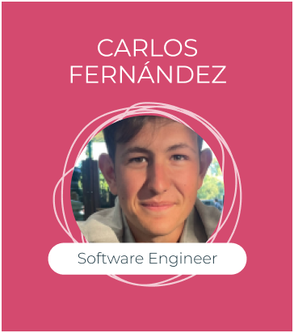
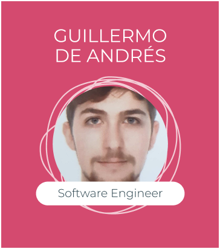

# Academy Summer 2023 Batch Wiki

Hi everyone! We are the Summer 2023 Batch of the Empathy.co Academy program. Even though each of us is based in a different side of the country, we are constantly in touch, learning from each other and growing as a team. Follow our journey throughout the experience and find out everything about what we have accomplished.

This Batch is a little different from the previous ones. This time, the software engineers and the business fellows will be divided in two general paths, without specialising before finding out what they really want to do with their future.

Get to know us in the following table! :smiley:

## Learning Paths & Its Fellows

| Software Path            | Business Path    |
| ------------------------ | ---------------- |
| [Alejandro Lorenzo](https://github.com/loreenzo02)        | [Claudia Murciego](https://github.com/empathyco/academy-batches/edit/batch_summer2023/Path/batch_summer2023/blog) |
| [Álvaro Ibáñez](https://github.com/UO282206)            | [Cova Fernández](https://github.com/empathyco/academy-batches/edit/batch_summer2023/Path/batch_summer2023/blog)   |
| [Ana Fernández](https://github.com/AnaOstio/)            | [Flori Pop](https://github.com/empathyco/academy-batches/edit/batch_summer2023/Path/batch_summer2023/blog)        |
| [Carlos Domínguez Alcázar](https://github.com/C4rlos99)         | [Paula Gutiérrez](https://github.com/empathyco/academy-batches/edit/batch_summer2023/Path/batch_summer2023/blog)  |
| [Carlos Fernández](https://github.com/ruky00)         | [Sara Corte](https://github.com/empathyco/academy-batches/edit/batch_summer2023/Path/batch_summer2023/blog)       |
| [David Gavira](https://github.com/davidg43)             |                  |
| [Gabriel Padilla](https://github.com/gabipr96)          |                  |
| [Germán Tocón](https://github.com/Ger-28)             |                  |
| [Guillermo de Andrés](https://github.com/Willygap1572)      |                  |
| [Jonathan Muñoz Morales](https://github.com/jonathanMM97)           |                  |
| [Jose Antonio Pérez](https://github.com/UO266575)       |                  |
| [José Cáceres Gómez](https://github.com/joscacgom)             |                  |
| [Luisma Baizán](https://github.com/LMBaizan)            |                  |
| [Manuel Alfonso Fernández](https://github.com/manfertej) |                  |
| [Matías García](https://github.com/mgg709)            |                  |
| [Mayte Fernández](https://github.com/teresafcoro)          |                  |
| [Miguel Angel Contreras](https://github.com/macontrerascordoba)   |                  |
| [Miguel Fierro Lerones](https://github.com/mikex2110)            |                  |
| [Tiberius Roman](https://github.com/Tiberiuss)           |                  |

## Meet the Fellows

### Software Path

Hello there! Welcome to our remarkable batch of individuals who bring their unique skills, knowledge, and enthusiasm to create extraordinary outcomes. We take great pride in presenting our diverse group of talented professionals who work together cohesively, leveraging their expertise to achieve remarkable results. Get acquainted with our team members and witness the brilliance that drives our success.

### Check our work [here](software.md)

### Business Path

Hello there! We are the Business Path, we are so excited to learn from every section of the Growth Department and the experience of our path owners who will be guiding us through all the process.

### Weekly Highlights

In this section we will share our most relevant achievements of the weeks, along with our thoughts on them.

#### WEEK 1

> "This week has been mainly about adaptation. We gathered a lot of knowledge about the company
> that helped us understand the product we will offer to our customers."
>
> -*Paula Gutiérrez Siliceo (Business)*

> "Over the course of this week, we have had the opportunity to become acquainted with both our company and our colleagues."
>
> -*Tiberius Roman (Software)*

#### WEEK 2

> "Our second week was mostly about adapting and getting to know how our colleagues. We had a lot of onboardings and we learned the main things from each department."
>
> -*Claudia Murciego (Business)*

> "During this week, we have continued with the onboardings and started discussing the idea of the CRUD app that we have to develop. We have also started getting to know each other, as the first donuts have arrived."
> 
> -*Matías García Gimeno (Software)*

#### WEEK 3

> "We had different classes on the most practical and technical parts of our company, this was very interesting for us. Having the opportunity of getting knowledge about the software part, to ensure that our customers will be perfectly informed."
>
> -*Cova Fernandez (Business)*

> "This week we have made the first introduction with Spring. In addition to continuing our individual work we are struggling with Elastic."
>
> -*Ana Fernández Ostio (Software)*

#### WEEK 4

> "During our fourth week we´ve been learning how to prospect and some training about our product."
>
> -*Sara Corte (Business)*

> "For most of the week we have been dealing with the new technologies we are learning to implement our group projects."
>
> -*Manuel Alfonso Fernández (Software)*
