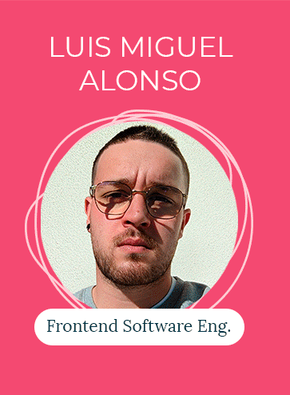
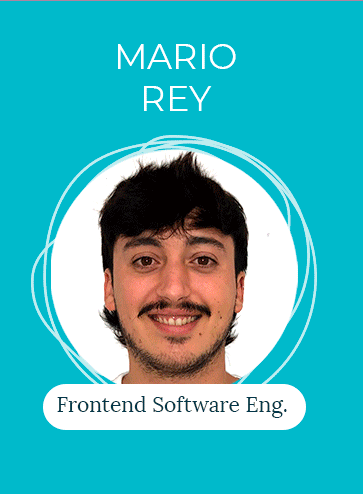
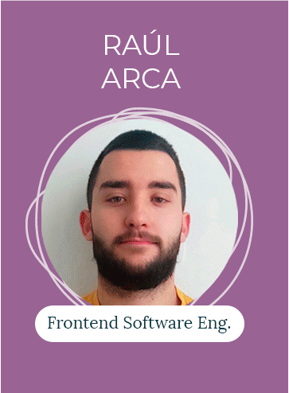
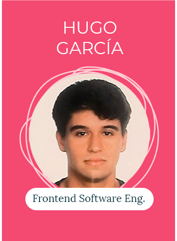
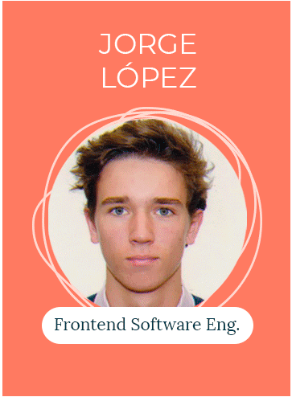
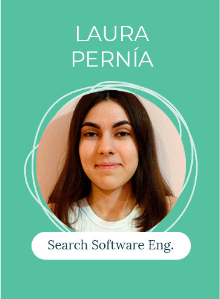

# Academy Winter 2023 Batch Wiki

Hey there! We are the Winter 2023 Batch of the Empathy.co Academy program, and in the following lines you will be able
to learn more about us, as well as all the work done throughout these 3 months. We all come from different places, degrees,
and backgrounds, but we are all thrilled to be here and learn new things.

In the table below you will find our names organized in the different learning paths chosen, as well as the links to our
GitHub pages. Enjoy!


## Learning Paths & Its Fellows

| Frontend Path                                       | Search Path            | Data Path             | Business Path         | HR Path         |
|-----------------------------------------------------|------------------------|-----------------------|-----------------------|-----------------|
| [Luis Miguel Alonso](https://github.com/lumialfe)   | [Juan Manuel Manga](https://github.com/juanma6245)       | [Óscar López](https://github.com/xondemingo)       | [Manuela Cuadros]()   | [Elena López]() |
| [Mario Rey](https://github.com/mariorey)            | [Marcos Arce]()        | [Ángel Iglesias](https://github.com/angelip2303)     | [María Suárez]()      | []()            |
| [Miguel Juncal](https://github.com/migueljuncalpz)  | [Christian González](https://github.com/ChristianGm25) | [Manuel Manga](https://github.com/manmanrod)  | [Lucas Abad]()        | []()            |
| [Pablo Benítez](https://github.com/Bamtop)          | [Noelia Iglesias](https://github.com/noeliaigc)    | [Jesús Alonso](https://github.com/gsusag00) | [Alejandro Herrero]() | []()            |
| [Raúl Arca](https://github.com/RaulArca)            | [Tania Bajo](https://github.com/taniabg23)         | []()      | [Celia Sors]()        | []()            |
| [Alberto Monedero](https://github.com/albertjcuac/) | [Guillermo de Leiva](https://github.com/gdeleiva) | []()                  | [Julia Fernández]()   | []()            |
| [Andreu Montagut](https://github.com/andmonosu)     | [José Pérez](https://github.com/josperrod9)         | []()                  | []()                  | []()            |
| [Hugo García](https://github.com/xHugo21)           | [Laís García](https://github.com/Laisgs)        | []()                  | []()                  | []()            |
| [Jorge López](https://github.com/jorge16lp)         | [Laura Pernía](https://github.com/laura-pb)       | []()                  | []()                  | []()            |
| []()                                                | [Raúl Álvarez](https://github.com/Raul-Alv)  | []()                  | []()                  | []()             |


## Meet the Fellows
The following sections will take you through the different Academy paths and its members. In each one you will find a short
description of what each team does, as well as pictures of all the Fellows, followed by a link to the different Blogs of
the paths, where you will find weekly reports on the activities and projects done by the members.

Ready? Here we go...

### Frontend Path 

Hey there! We are the Frontend Path. Our main focus is to learn all about HTML, CSS, JavaScript, Vue... We are the ones
in charge of making the application look fancy and be usable for everyone out there. We come from different cities all
around Spain to bring you the best user experience possible.

This is us, and this is our work:

<div class="img_academy_2023">
 
 
 
 
 
 
 
 
 
</div>

#### Check our work [here](front.md)!

---

### Search/Back Path

//TODO

<div class="img_academy_2023">
  
 
 
 
 
 
 
 
 
 
</div>

You can check their progress [here](back.md)

---

### Data Path

Hello there! We are the Data Path. Our main focus is to learn all about how to handle and manage data. Our work isn't really visible like other paths, but trust us, we are working even if it doesn't look like it.

```

    Roses are red, violets are blue,
    My data’s a mess, what should I do?

```

<div class="img_academy_2023">
 
 
 
 
</div>

You can check their progress [here](data.md)

---

### Business Path

//TODO

<div class="img_academy_2023">
 
 
 
 
 
 
</div>

You can check their progress [here](business.md)

---

### HR Path

//TODO

<div class="img_academy_2023">
 
</div>

You can check their progress [here](hr.md)

---


