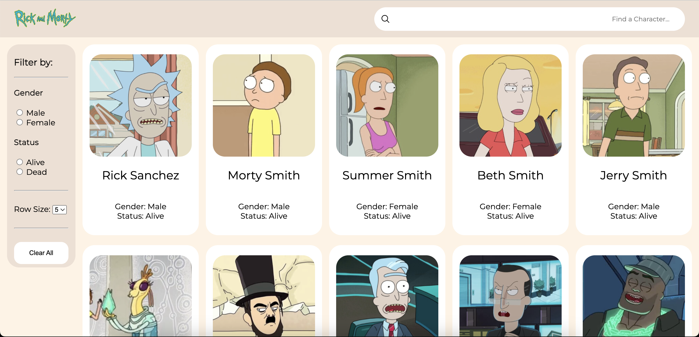
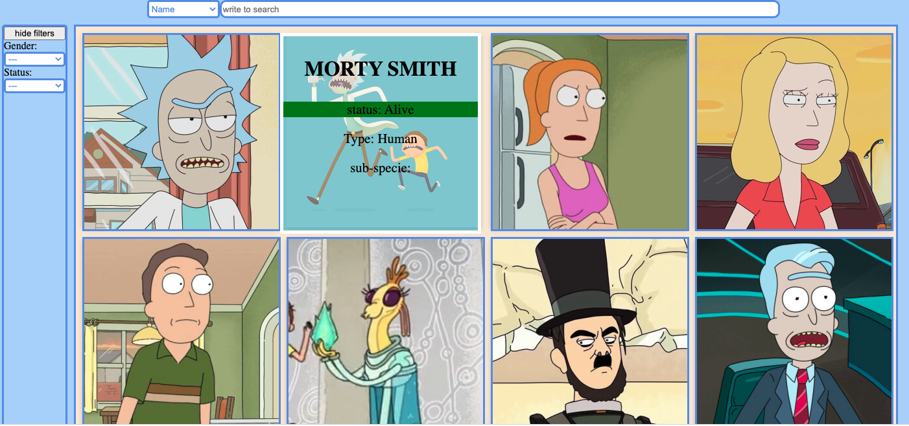
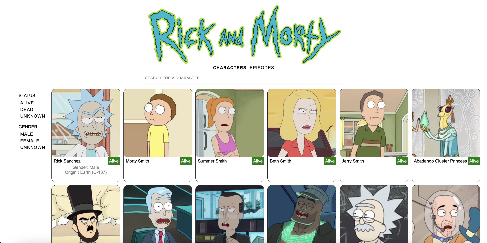
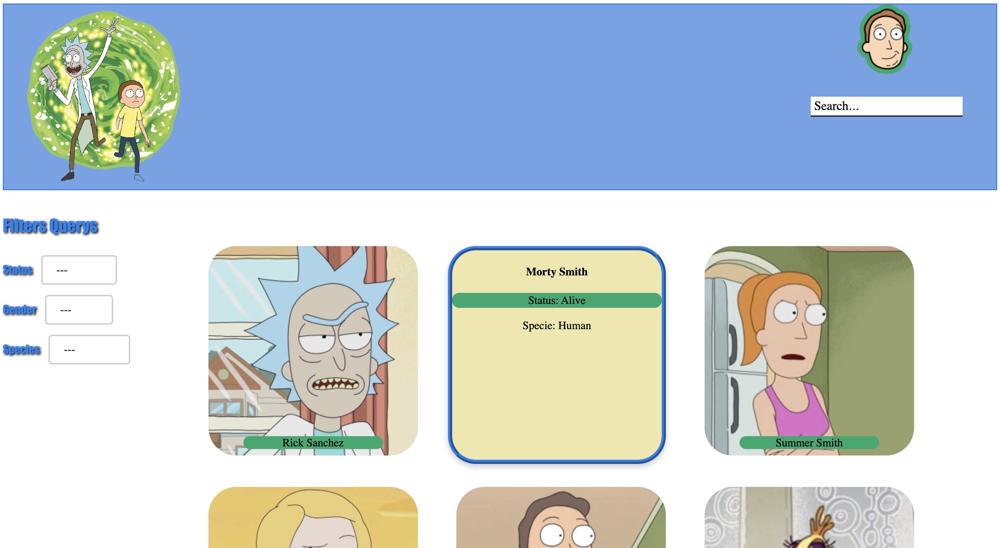
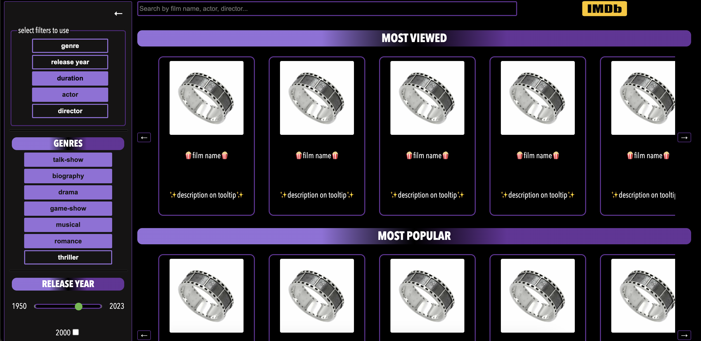
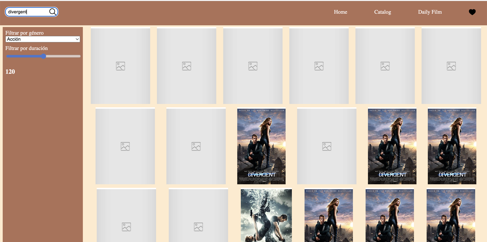

# Frontend Path - Winter 2023

## Content Table
- [Content Table](#content-table)
- [Week 1](#week-1)
  - [Exercise: Rick&Morty Search Page (JavaScript)](#rickmorty-javascript)
- [Week 2](#week-2)
  - [Exercise: Rick&Morty Search Page (VUE)](#rickmorty-vue)
- [Week 3](#week-3)
  - [Exercise: Rick&Morty Search Page (VUE)](#rickmorty-vuex)
- [Week 4](#week-4)
  - [Exercise: Rick&Morty Search Page (VUE)](#rickmorty-typescript)
- [Week 5](#week-5)
  - [Project: IMDb](#imdb-project)

----------------------------------------------------------------
## Week 1
First week on the Frontend path of the Academy program at Empathy.co was focused on HTML, CSS & JS. We received several
classes regarding these topics, as well as some more in depth ones, like responsive CSS or JSDOM. The following were the
people in charge of delivering said classes.

| **Path Owner** | **Content Deliverers** | 
|----------------|------------------------| 
| Beltrán García | Pedro Ondiviela        |
|                | Antonio Cuenca         |
|                | Guillermo Cancheda     |

\
**Key learning points** <!-- (Do not change this line!!!) -->
1. Basic HTML & CSS.
2. Responsive Design
3. JavaScript & Basic TypeScript
4. JSDOM & DevTool

### Rick&Morty JavaScript
Week one was a warmup for what it is to come. We came back to basics going over HTML, CSS & JS properties and main functionalities.
The idea behind these classes was mostly to learn about useful CSS properties like Grid or Flex.
The task to be done was a Web Browser that would make calls to a Rick&Morty API, displaying its characters in a responsive 
fashion.

These are some examples made by the Academy Fellows:
- #### [Rick & Morty Repository](https://github.com/lumialfe/Rick-Morty_EmpathyAcademy) by [LuisMi Alonso](https://github.com/lumialfe) - [Watch the Website Here](https://lumialfe.github.io/Rick-Morty_EmpathyAcademy/)
- #### [Rick & Morty Repository](https://github.com/mariorey/RickAndMortyAPI) by [Mario Rey](https://github.com/mariorey) - [Watch the Website Here](https://lumialfe.github.io/Rick-Morty_EmpathyAcademy/)
- #### [Rick & Morty Repository](https://github.com/RaulArca/rick-and-morty-browser) by [Raúl Arca](https://github.com/RaulArca) - [Watch the Website Here](https://raularca.github.io/rick-and-morty-browser/)
- #### [Rick & Morty Repository](https://github.com/Bamtop/Rick-Morty-Api-Exercise) by [Pablo Benítez](https://github.com/bamtop) - [Watch the Website Here](https://bamtop.github.io/Rick-Morty-Api-Exercise/src/)

----------------------------------------------------------------
## Week 2
In the second week the Frontend path of the Academy program at Empathy.co was learning how to use vue. 
For this we received a class about the basics of it. After that we were given a practical exercise 
with the objective of reinforcing the contents seen in the aforementioned class.
The following were the people in charge of delivering said class.

| **Path Owner** | **Content Deliverers** | 
|----------------|------------------------| 
| Beltrán García | Alonso Garcia  |

\
**Key learning points** <!-- (Do not change this line!!!) -->
1. Learn how to use vue components 
2. Learn the use of vue instructions such as v-for, v-bind
3. Learn the communication between components
4. Become familiar with the use of slots 

### Rick&Morty Vue

Continuing with the work done in week 1 we had to move it to transform the HTML, CSS and Javascript project
into a Vue project.

These are some examples made by the Academy Fellows:

- #### [Rick & Morty browser with vue](https://github.com/RaulArca/rick-morty-browser-with-vue) by [Raúl Arca](https://github.com/RaulArca) 
- #### [Rick & Morty Repository](https://github.com/lumialfe/Rick-Morty_EmpathyAcademy) by [LuisMi Alonso](https://github.com/lumialfe) 
- #### [API Rick and Morty Vue](https://github.com/migueljuncalpz/api-rickandmorty-vue) by [Miguel Juncal](https://github.com/migueljuncalpz)
- #### [Rick and Morty Vue](https://github.com/mariorey/RickAndMortyVUE) by [Mario Rey](https://github.com/mariorey) - [Watch the Website Here](https://mariorey.github.io/RickAndMortyVUE/)
- #### [Vue challenge](https://github.com/jorge16lp/Vue_challenge) by [Jorge López](https://github.com/jorge16lp)
- #### [Rick and Morty Exercise with Vue](https://github.com/andmonosu/Rick-and-Morty-Exercise-with-Vue/) by [Andreu Montagut](https://github.com/andmonosu) - [Watch the Website Here](https://andmonosu.github.io/Rick-and-Morty-Exercise-with-Vue/)
- #### [First Project with Vue](https://github.com/bamtop/First-Project-Vue/) by [Pablo Benítez](https://github.com/bamtop) - [Watch the Website Here](https://bamtop.github.io/First-Project-Vue/)
- #### [Rick and Morty Vue](https://github.com/albertjcuac/rickandmortyvue/) by [Alberto Monedero](https://github.com/albertjcuac) - [Watch the Website Here](https://albertjcuac.github.io/rickandmortyvue/)
- #### [Rick and Morty Vue](https://github.com/xHugo21/exercise2_academy) by [Hugo García](https://github.com/xHugo21) - [Watch the Website Here](https://xhugo21.github.io/exercise2_academy/)

----------------------------------------------------------------
## Week 3
In the third week we learned how to create a store using Vuex library to manage every state existing in the application.
This includes changing our repository logic into a more compact one and adding getters, mutations and actions to complete the state's managing mentioned before.

| **Path Owner** | **Content Deliverers** | 
|----------------|------------------------| 
| Beltrán García | Manuel Navarro         |

**Key learning points** <!-- (Do not change this line!!!) -->
1. Learn how the Vuex framework works
2. Define states for the application
3. Implement getters and mutation in order to correctly apply good coding practices
4. Change every module's logic to make them access to the states in the store

### Rick&Morty Vuex
Continuing with the work done in week 2 we had to add the Vuex library to simplify our code.

You can see their work here:
- #### [Rick & Morty browser with vue](https://github.com/RaulArca/rick-morty-browser-with-vue/tree/vuex-challenge) by [Raúl Arca](https://github.com/RaulArca)
- #### [Rick & Morty Repository](https://github.com/lumialfe/Rick-Morty_Vue_EmpathyAcademy/tree/main) by [LuisMi Alonso](https://github.com/lumialfe)
- #### [API Rick and Morty Vue](https://github.com/migueljuncalpz/api-rickandmorty-vue) by [Miguel Juncal](https://github.com/migueljuncalpz)
- #### [Rick and Morty Vue](https://github.com/mariorey/RickAndMortyVUE/tree/vuex-challenge) by [Mario Rey](https://github.com/mariorey) - [Watch the Website Here](https://mariorey.github.io/RickAndMortyVUE/)
- #### [Vue challenge](https://github.com/jorge16lp/Vue_challenge/tree/VueX_challenge) by [Jorge López](https://github.com/jorge16lp)
- #### [Rick and Morty Exercise with Vue](https://github.com/andmonosu/Rick-and-Morty-Exercise-with-Vue/tree/VueX-Challenge) by [Andreu Montagut](https://github.com/andmonosu) - [Watch the Website Here](https://andmonosu.github.io/Rick-and-Morty-Exercise-with-Vue/)
- #### [First Project with Vue](https://github.com/bamtop/First-Project-Vue/tree/vuex-challenge) by [Pablo Benítez](https://github.com/bamtop) - [Watch the Website Here](https://bamtop.github.io/First-Project-Vue/)
- #### [Rick and Morty Vue](https://github.com/albertjcuac/rickandmortyvue/tree/vuex-challenge) by [Alberto Monedero](https://github.com/albertjcuac) - [Watch the Website Here](https://albertjcuac.github.io/rickandmortyvue/)
- #### [Rick and Morty VueX](https://github.com/xHugo21/exercise2_academy/tree/vuex-challenge) by [Hugo García](https://github.com/xHugo21) - [Watch the Website Here](https://xhugo21.github.io/exercise2_academy/)

----------------------------------------------------------------
## Week 4
In the fourth week we learned about TypeScrip to implement types to JavaScript.We received a class about basic and some stuff advantage TypeScript.After that we were given some exercises with the objetive of reinforcing the contents and The Path Owner recommended us to tried to apply TypeScript in our Vuex Project

| **Path Owner** | **Content Deliverers** | 
|----------------|------------------------| 
| Beltrán García | Manuel Navarro         |

**Key learning points** <!-- (Do not change this line!!!) -->
1. What is TypeScript?
2. How to adding ts into existing project
2. Learn about basic types
4. Learn about Interfaces
5. Advance types (any, generic, union, intersection)

### Rick&Morty TypeScript
Continuing with the work done in week 3 we had to add TypeScript for add type in our code.

Some examples from our Academy Fellows:
- #### [First Project with Vue](https://github.com/Bamtop/First-Project-Vue/tree/vuex-typescript) by [Pablo Benítez](https://github.com/bamtop) - [Watch the Website Here](https://bamtop.github.io/First-Project-Vue/)
- #### [Rick and Morty Vue](https://github.com/albertjcuac/rickandmortyvue/tree/typescript-challenge) by [Alberto Monedero](https://github.com/albertjcuac) - [Watch the Website Here](https://albertjcuac.github.io/rickandmortyvue/)
- #### [Rick and Morty Exercise with Vue](https://github.com/andmonosu/Rick-and-Morty-Exercise-with-Vue/tree/Typescript) by [Andreu Montagut](https://github.com/andmonosu) - [Watch the Website Here](https://andmonosu.github.io/Rick-and-Morty-Exercise-with-Vue/)
- #### [Rick and Morty VueX](https://github.com/xHugo21/exercise2_academy/tree/typescript-challenge) by [Hugo García](https://github.com/xHugo21) - [Watch the Website Here](https://xhugo21.github.io/exercise2_academy/)
- #### [Vue challenge](https://github.com/jorge16lp/Vue_challenge/tree/TypeScript_challenge) by [Jorge López](https://github.com/jorge16lp)
- #### [Rick & Morty Repository](https://github.com/lumialfe/Rick-Morty_Vue_EmpathyAcademy/tree/ts_chanllenge) by [LuisMi Alonso](https://github.com/lumialfe) - [Watch the Website Here](https://lumialfe.github.io/Rick-Morty_Vue_EmpathyAcademy/)
- #### [Rick and Morty Vue](https://github.com/mariorey/RickAndMortyVUE/tree/vuex-typescript2) by [Mario Rey](https://github.com/mariorey) - [Watch the Website Here](https://mariorey.github.io/RickAndMortyVUE/)
- #### [Rick & Morty browser with vue](https://github.com/RaulArca/rick-morty-browser-with-vue/tree/TypeScript) by [Raúl Arca](https://github.com/RaulArca)
- #### [API Rick and Morty Vue](https://github.com/migueljuncalpz/api-rickandmorty-vue) by [Miguel Juncal](https://github.com/migueljuncalpz) - [Watch the Website Here](https://migueljuncalpz.github.io/api-rickandmorty-vue/)

----------------------------------------------------------------
## Week 5
In the fifth week we already had practice with TypeScript and, waiting to have another front session, we started our IMDb front-back project. In addition, we received information about how to apply TypeScript in our Rick&Morty project and, therefore, in the IMDb project as well

| **Path Owner** | **Content Deliverers** | 
|----------------|------------------------| 
| Beltrán García | Manuel Navarro         |

**Key learning points** <!-- (Do not change this line!!!) -->
1. Applying TypeScript to a larger project
2. Starting your own project from scratch

### IMDb project
Based on what we learned with the different Rick&Morty practice projects, we started our own project

 
Some examples from our Academy Fellows:
- #### [imdb-project](https://github.com/migueljuncalpz/imdb-project) by [Miguel Juncal](https://github.com/migueljuncalpz)
- #### [IMDb_FINDR](https://github.com/lumialfe/IMDb_FINDR) by [LuisMi Alonso](https://github.com/lumialfe)
- #### [iMDb-Project](https://github.com/andmonosu/iMDb-Project) by [Andreu Montagut](https://github.com/andmonosu)
- #### [IMDB-academy-project](https://github.com/Bamtop/IMDB-academy-project) by [Pablo Benítez](https://github.com/bamtop)
- #### [IMDb-front](https://github.com/albertjcuac/IMDb-front) by [Alberto Monedero](https://github.com/albertjcuac)
- #### [imdb_academy](https://github.com/xHugo21/imdb_academy) by [Hugo García](https://github.com/xHugo21) - [Watch the Website Here](https://xhugo21.github.io/imdb_academy/)
- #### [IMDB_Project](https://github.com/mariorey/IMDB_Project) by [Mario Rey](https://github.com/mariorey) - [Watch the Website Here](https://mariorey.github.io/IMDB_Project/)
- #### [IMdbFont](https://github.com/RaulArca/IMdbFont) by [Raúl Arca](https://github.com/RaulArca)
- #### [IMDb](https://github.com/jorge16lp/IMDb) by [Jorge López](https://github.com/jorge16lp)

----------------------------------------------------------------
## Week 6
In the sixth week, we keep developing our IMDb front-back project, which we started to develop the week before. Also, we had a session where we learn how to implement unit tests in our Vue projects using the test runner vitest, this tool help us to test Vue components in a Vue project.

| **Path Owner** | **Content Deliverers** | 
|----------------|------------------------| 
| Beltrán García | Manuel Navarro         |

**Key learning points** <!-- (Do not change this line!!!) -->
1. Applying TypeScript to a larger project
2. How to test a Vue project
3. Learn about unit testing
4. How to test Vue components
5. How to use vitest for testing Vue components

### IMDb project
Continuing with the work started in week 5, we keep improving our IMDB projects.

 
Some examples from our Academy Fellows:
- #### [imdb-project](https://github.com/migueljuncalpz/imdb-project) by [Miguel Juncal](https://github.com/migueljuncalpz)
- #### [IMDb_FINDR](https://github.com/lumialfe/IMDb_FINDR) by [LuisMi Alonso](https://github.com/lumialfe)
- #### [iMDb-Project](https://github.com/andmonosu/iMDb-Project) by [Andreu Montagut](https://github.com/andmonosu)
- #### [IMDB-academy-project](https://github.com/Bamtop/IMDB-academy-project) by [Pablo Benítez](https://github.com/bamtop)
- #### [IMDb-front](https://github.com/albertjcuac/IMDb-front) by [Alberto Monedero](https://github.com/albertjcuac)
- #### [imdb_academy](https://github.com/xHugo21/imdb_academy) by [Hugo García](https://github.com/xHugo21) - [Watch the Website Here](https://xhugo21.github.io/imdb_academy/)
- #### [IMDB_Project](https://github.com/mariorey/IMDB_Project) by [Mario Rey](https://github.com/mariorey) - [Watch the Website Here](https://mariorey.github.io/IMDB_Project/)
- #### [IMdbFont](https://github.com/RaulArca/IMdbFont) by [Raúl Arca](https://github.com/RaulArca)
- #### [IMDb](https://github.com/jorge16lp/IMDb) by [Jorge López](https://github.com/jorge16lp)